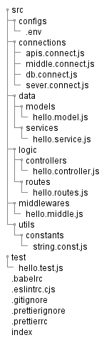

# Node Js

### Auteur : James Brel (The Coder)
### Contact : thecoder38@gmail.com, jamesbrel119@gmail.com 

### Architecture Of Node Js Server (MVC)

Note: the architecture is based on the order MC ==> Model, Controller

### Usage

Once you have the package.json file by running ***npm init***, simply follow these steps

After downloading or cloning the Git Repository 
  1. go to the node_architecture folder and copy the folders
  2. Then follow the steps in the ***Configuration.txt*** file

----------------------------------------

 Copyright &copy; 2023 Utech All Rights Reserved
